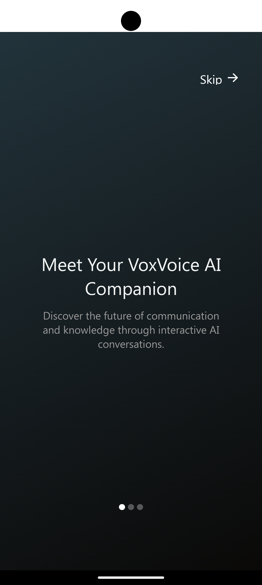
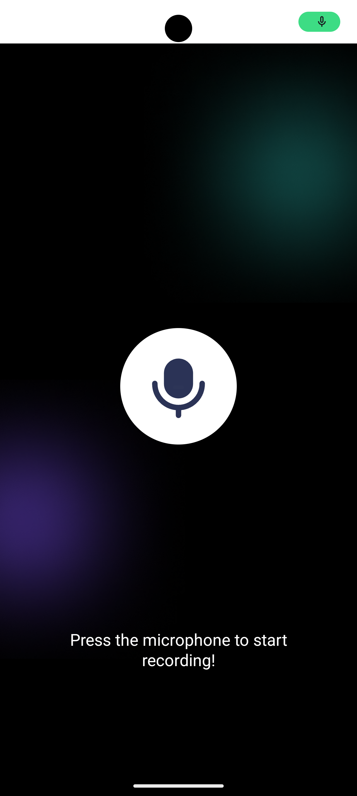

# voxvoiceai

# VoxVoice Ai

<h1>VoxVoice e AI Assistant Application Project Summary</h1>

This Voice AI Assistant is a smart, voice-activated application designed to make everyday tasks easier and more efficient. Powered by advanced speech recognition and natural language processing (NLP) technologies, the assistant listens to user commands, understands context, and responds with relevant information or actions. From answering questions and setting reminders to controlling smart devices and providing personalized recommendations, this app serves as a versatile, hands-free companion.
With a user-friendly interface and seamless integration, the VoiceVox AI Assistant is perfect for those looking to streamline their day-to-day activities with simple voice commands.

<h1></h1>
<h1></h1>
<h1>Onboarding Screen</h1>

<h1></h1>
<h1>Onboarding Screen</h1>

<h1></h1>
<h1></h1>
<h1>Onboarding Screen</h1>

<h1></h1>
<h2>Authentication: Clerk</h2>

<h1></h1>

  

<picture>
  <source media="(prefers-color-scheme: dark)" srcset="https://raw.githubusercontent.com/tobiasmeyhoefer/tobiasmeyhoefer/output/github-snake-dark.svg" />
  <source media="(prefers-color-scheme: light)" srcset="https://raw.githubusercontent.com/tobiasmeyhoefer/tobiasmeyhoefer/output/github-snake.svg" />
  
</picture>

